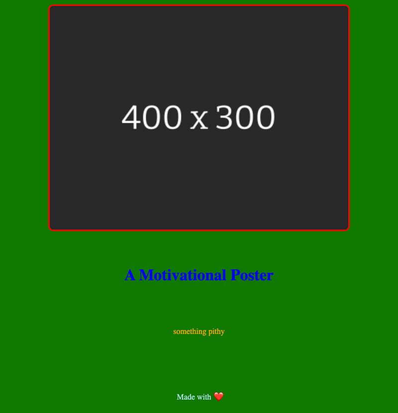

# motivational-picture-generator

A project to learn NodeJS, ExpressJS, and whatever else along the way.

> [!CAUTION]
> **THIS IS ALL WORK IN PROGRESS AND SUBJECT TO CHANGE**


To start server

```bash
npm run dev
```

Make url request to `localhost:4000` with. Not providing all the parameters will cause the render to fail atm. Have only added optional checking for CSS colors for now with garish defaults so I can see if something failed.

```bash
wget --output-document screenshot.png 'http://localhost:4200/submit/mpgParams?title=A Motivational Poster&sentence=something pithy&imageWidth=600px&imageUrl=https://dj.tdn.wf/image/400x300/282828&titleColor=blue&sentenceColor=orange&borderColor=red&backgroundColor=%23107a00'
```

This generates



Testing with

```bash
ab -c 5 -t 15 http://localhost:4000/submit/\{\}
```

## Supported Arguments

Arguments with :bangbang: are currently required

* `title` string that will be used for the H1 under :bangbang:
* `sentence` string that will be presented below the H1 :bangbang:
* `imageURL` url of the image to use :bangbang:
* `imageWidth` px value to constrain the image size :bangbang:
* `titleColor` either the word name of a color that css supports, or the hex value (__note__ if using hex then you need to encode the # as `%23`)
* `sentenceColor` either the word name of a color that css supports, or the hex value (__note__ if using hex then you need to encode the # as `%23`)
* `backgroundColor` either the word name of a color that css supports, or the hex value (__note__ if using hex then you need to encode the # as `%23`)
* `borderColor` either the word name of a color that css supports, or the hex value (__note__ if using hex then you need to encode the # as `%23`). This will only be used in certain border types.
* `borderType` name of the border to use. If not supplied no border is added.

Currently supported border types:

* `basic-border` just a simple colored bordered

* `corner-only-border` a fancy colored border that only goes around the corners. Defaults atm to pink if `borderColor` isn't supplied


## Thanks

* Ana Tudor for the [corner-only-border](https://codepen.io/thebabydino/pen/QWMaPQb) codepen.